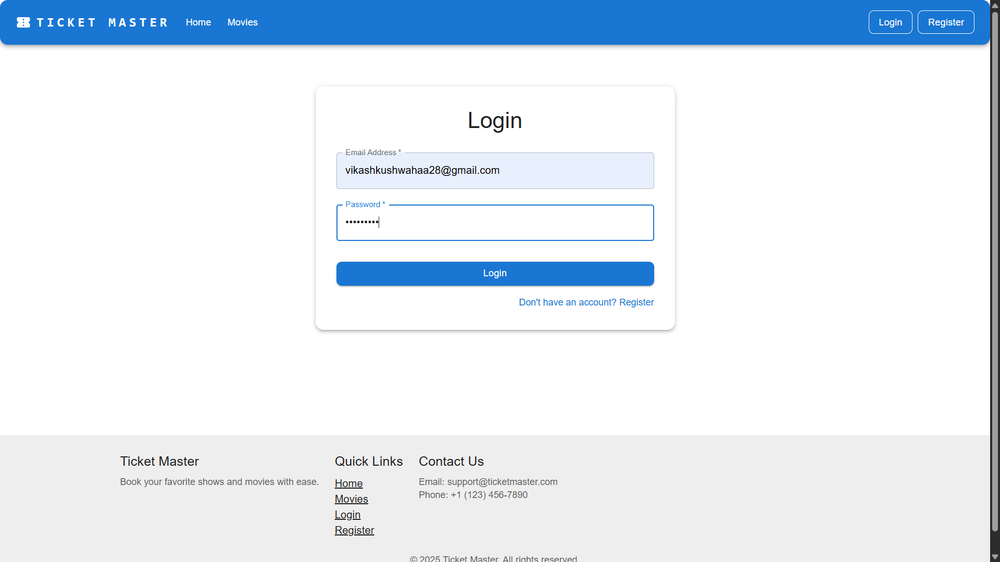

# Movie Ticket Booking App

A full-featured Ticket Booking Application with the following capabilities:

- **User Authentication:** Users can register and log in with email verification mechanisms to ensure secure access.
- **Home Page:** Displays at least 5 shows or movies, each with a dedicated details page providing comprehensive information about the show/movie.
- **Seat Booking:** Users can select their desired seats for a chosen show. Once seats are selected and the user proceeds to checkout, those seats are blocked and become unavailable for other users, preventing double booking.
- **Checkout & Payment:** Seamless and secure checkout process integrated with Razorpay payment portal. Users can complete transactions easily and securely.
- **Booking Confirmation & Receipts:** After successful payment, users receive a booking confirmation and a digital receipt. All receipts are saved and can be accessed for future reference.
- **Responsive UX Design:** The application is designed to be user-friendly and fully responsive, ensuring a smooth browsing and booking experience across all devices (desktop, tablet, mobile).

## Features

- User authentication (signup, login, email verification)
- Browse movies and showtimes
- Select and book seats
- Secure payment processing with Razorpay
- View booking history and receipts

## Project Structure

- `/src` - Frontend React application
- `/server` - Backend server for Razorpay integration

## Setup and Installation

### Frontend

1. Install dependencies:
   ```
   npm install
   ```

2. Configure Firebase:
   - Create a Firebase project
   - Enable Email/Password authentication
   - Add your Firebase configuration to `src/services/firebase.js`

3. Start the development server:
   ```
   npm start
   ```

### Backend (Razorpay Integration)

1. Navigate to the server directory:
   ```
   cd server
   ```

2. Install dependencies:
   ```
   npm install
   ```

3. Configure environment variables:
   - Create a `.env` file in the server directory
   - Add your Razorpay API keys and other configuration

4. Start the server:
   ```
   npm start
   ```
   For development with auto-restart:
   ```
   npm run dev
   ```

## Creating the .env File for Backend

To enable Razorpay integration and secure server configuration, you need to create a `.env` file in the `server` directory with the following variables:

```
RAZORPAY_KEY_ID=your_razorpay_key_id
RAZORPAY_KEY_SECRET=your_razorpay_key_secret
PORT=5000
WEBHOOK_SECRET=your_webhook_secret
```

- Replace `your_razorpay_key_id` and `your_razorpay_key_secret` with your Razorpay API credentials.
- Set `PORT` to your desired backend port (default is 5000).
- Set `WEBHOOK_SECRET` to a secure string for verifying Razorpay webhooks.

## Creating the .env File for Frontend

To securely configure Firebase in your React app, you must create a `.env` file in the **root directory of your project** (the same level as `package.json`, not inside `src` or any subfolder). This file will not be tracked by git if you have followed the .gitignore setup.

**Steps to create the .env file in the root:**
1. In your project root (where `package.json` is located), create a new file named `.env`.
2. Add the following line to the file:
   ```
   REACT_APP_FIREBASE_API_KEY=your_firebase_api_key_here
   ```
3. Replace `your_firebase_api_key_here` with your actual Firebase API key.

- The code now loads the API key from the environment variable (`process.env.REACT_APP_FIREBASE_API_KEY`) for improved security.

## Razorpay Integration

The application uses Razorpay for secure payment processing. The integration includes:

- Frontend components for payment initiation
- Backend API for creating orders and verifying payments
- Secure handling of payment verification using cryptographic signatures

## Security Considerations

- API keys are stored in environment variables
- Payment verification is done on the server side
- Webhook events are verified using signatures

## Technologies Used

- React
- Firebase (Authentication, Firestore)
- Material-UI
- Express.js
- Razorpay Payment Gateway

## Available Scripts

In the project directory, you can run:

### `npm start`

Runs the app in the development mode.
Open [http://localhost:3000](http://localhost:3000) to view it in your browser.

### `npm test`

Launches the test runner in the interactive watch mode.

### `npm run build`

Builds the app for production to the `build` folder.

## Application Screenshots

Below are grouped screenshots demonstrating various features and pages of the Movie Ticket Booking App.

### Admin Features

<table><tr>
<td></td>
<td></td>
<td></td>
<td></td>
</tr><tr>
<td>Admin access denied (normal user)</td>
<td>Admin dashboard: Add movie</td>
<td>Admin dashboard: Add new movie (filled)</td>
<td>Admin dashboard: Existing movie details</td>
</tr></table>

### Authentication & Registration

<table><tr>
<td></td>
<td></td>
<td></td>
</tr><tr>
<td>Login page</td>
<td>Register page (filled)</td>
<td>Email verification link</td>
</tr></table>

### Booking & Movie Browsing

<table><tr>
<td></td>
<td></td>
<td></td>
<td></td>
</tr><tr>
<td>Homepage: Featured movies</td>
<td>Now showing movies</td>
<td>Movie details: Inception</td>
<td>Select seats page</td>
</tr><tr>
<td></td>
<td></td>
</tr><tr>
<td>Checkout: Booking details</td>
<td>My bookings page</td>
</tr></table>

### Payment & Checkout

<table><tr>
<td></td>
<td></td>
<td></td>
<td></td>
</tr><tr>
<td>Checkout: Payment confirmation</td>
<td>Confirming payment</td>
<td>Creating order credentials log</td>
<td>Payment options: Add new card</td>
</tr><tr>
<td></td>
<td></td>
<td></td>
</tr><tr>
<td>Payment options: Card entry</td>
<td>Payment options: Save card prompt</td>
<td>Razorpay payment loader</td>
</tr></table>

### User Profile & Settings

<table><tr>
<td></td>
<td></td>
<td></td>
<td></td>
</tr><tr>
<td>My profile (editable)</td>
<td>Profile updated success</td>
<td>Change password form</td>
<td>Password changed success</td>
</tr></table>

### Navigation & Other

<table><tr>
<td></td>
<td></td>
</tr><tr>
<td>User dropdown menu (logged in)</td>
<td>Why choose us page</td>
</tr></table>

## Author

Vikash Kushwah
- GitHub: [vikash-kushwah](https://github.com/vikash-kushwah)
- Linkedin: [vikashkushwahaa28](https://www.linkedin.com/in/vikashkushwahaa28/)

## Acknowledgments

This project was created as part of the Celebal Technologies React internship program.